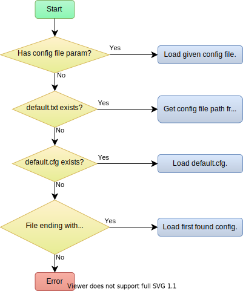

# Robot2
Control android phone automatically with configurable tasks. The project is based on scrcpy, extended with image detection, task execution and virtual console.

## Usage
```
Robot2.exe [config_file]
```


## Controls

| Key | Description |
| --- | --- |
|**Tab**| Toggle Console.
|**Alt + S**| Take screenshot.
|**Alt + O**| Turn screen on/off.
|**F2** | Turn screen off.|
|**F3** |Turn screen on.|
|**Alt + P** or **F1**| Power button.|
|**Alt + H**| Home button.|
|**Alt + M**| Menu button.|
|**Alt + B** or <br> **Alt + Backspace**| Back button.|
|**Alt + Up**| Volume up button.|
|**Alt + Down**| Volume down button.|
|**Alt + Left**| Rotate view left.|
|**Alt + Right**| Rotate view right.|
|**Alt + X**| Clipboard cut.|
|**Alt + C**| Clipboard copy.|
|**Alt + V**| Clipboard paste.|
|**Alt + F**| Toggle fullscreen.|
|**Alt + W**| Resize window to fit.|
|**Alt + G**| Resize window to 1:1.|
|**Alt + I**| Toggle FPS counter.|
|**Alt + N**| Toggle notification panel.|
|**Alt + R**| Rotate device.|

More details here: [input_manager.cpp](Robot2/scrcpy/input_manager.cpp) in function InputManager::ProcessKey.

## Console commands

| Command | Description |
| --- | --- |
|**touch [on\|off\|0\|1\|enable\|disable]**| Enables/Disables automatic touch actions.|
|**load <config_name>**| Loads the given config file or if it doesn't exist, then tries to load <br> <config_name>+".cfg", <config_name>+".txt", <config_name>+"config.txt".|

More details here: [ConsoleCommands.cpp](Robot2/console/ConsoleCommands.cpp)


## Config file
### Structure
```
// Global Options
// written as "key = value" pairs
// separated by new lines.

objects = (
// Template images' list.
)

actions = (
// Actions' list.
)
```
### Global options
#### scan_wait_ms
Wait time in ms between object detections.

Default: 500.

Example: ```scan_wait_ms = 900```
#### scan_wait_random_ms
Random wait time in ms between object detections.

Default: 0.

Example: ```scan_wait_random_ms = 200```
#### image_channel
Image channel used for object detection.

Valid values: R (red), G (green), B (Blue), Grayscale, H, S, V.

Default: Grayscale.

Example: ```image_channel = "R"```
#### detector
Keypoint detector algorithm used for object detection.

Valid values: AKAZE_DESCRIPTOR_KAZE_UPRIGHT, AKAZE_DESCRIPTOR_MLDB,	ORB, ORB_BEBLID, BRISK, BRISK_BEBLID, SURF, SURF_BEBLID, SIFT, SIFT_BEBLID.

Default: ORB_BEBLID.

Example: ```detector = "ORB_BEBLID"```
#### matcher

Feature matching algorithm used for object detection.

Valid values: BRUTEFORCE_HAMMING, BRUTEFORCE_HAMMINGLUT, BRUTEFORCE (uses L2), BRUTEFORCE_L1, BRUTEFORCE_SL2, FLANNBASED.

Default: BRUTEFORCE_HAMMING.

Example: ```matcher = "BRUTEFORCE_HAMMING"```
#### source
Input source.

Only android supported.

Example: ```source = "android"```
#### counter_limit
Default: 100.

Example: ```counter_limit = 100```
#### estimator_history
Default: 8.

Example: ```estimator_history = 8```
#### init_state
Initial state set on program start (config load).

Example: ```init_state = "unknown"```
#### min_detect_quality
Global minimum image detection quality.

Default: 0.1.

Example: ```min_detect_quality = 0.06```

### Object list

**Sample object list**

```
objects = (
	{image="path/to/image.png", name="template_name"},
	{image="path/to/image_2.png", name="other_template"}
)
```
### Action entry
Defines conditions and a sequence of tasks that needs to be executed when the mentioned conditions are met.

Must contain (**state** or **state_blacklist**), **on** and **do** parameters.
```
{
  state = [...]
  on = {...}
  do = (...)
}
```
State contains a state or state list that limits the actions evaluation to the given states.
```
state = ["state1","state2"]
```
Alternatively, **state_blacklist** field can be used which acts as a negated state list.
```
state_blacklist = ["disallowed_state","disallowed_state_2"]
```
The **on** parameter contains a condition set.

**Timeout example**
```
on={ timeout="6s" }
```
**Object detection examples**
```
on={ object={found="obj_name"} }
```
```
on={ object={not_found="obj_name"} }
```
The **do** parameter contains a list of tasks which are executed when the action's conditions are met.

**Task examples**

Click task
```
{click={on="close", at="center80%", delay="200ms", random_delay="100ms"}}
```
Waiting task
```
{wait={delay="1000ms", random_delay="100ms"}}
```
Counter incrementing task (used by the remaining time estimator)
```
{counter_add=1, if_state="current_state"}
```
Set state task.
```
{state="new_state"}
```
**Sample action entry**
```
{
  state = ["current_state","other_current_state"]
  on={ objects=({found="template_name",at="bottom20%"}, {not_found="other_template",at="bottom50%,right50%"}) }
  do=(
    {click={on="close", at="center80%", delay="200ms", random_delay="100ms"}},
    {wait={delay="1000ms", random_delay="100ms"}},
    {counter_add=1, if_state="current_state"},
    {state="new_state"}
  )
}
```
